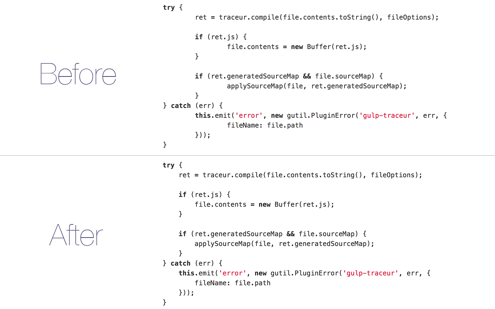

# Tab Size on GitHub

> Chrome extension - Make tab indented code more readable by forcing the tab size to 4 instead of 8

It's intentionally simple and I'm not interested in adding anything more to it.

## Install

Install it from the [Chrome Web Store](https://chrome.google.com/webstore/detail/tab-size-on-github/ofjbgncegkdemndciafljngjbdpfmbkn) or [manually](http://superuser.com/a/247654/6877).

## License

MIT © [Sindre Sorhus](https://sindresorhus.com)
